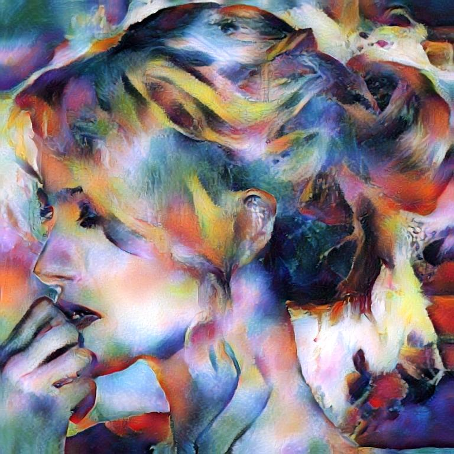
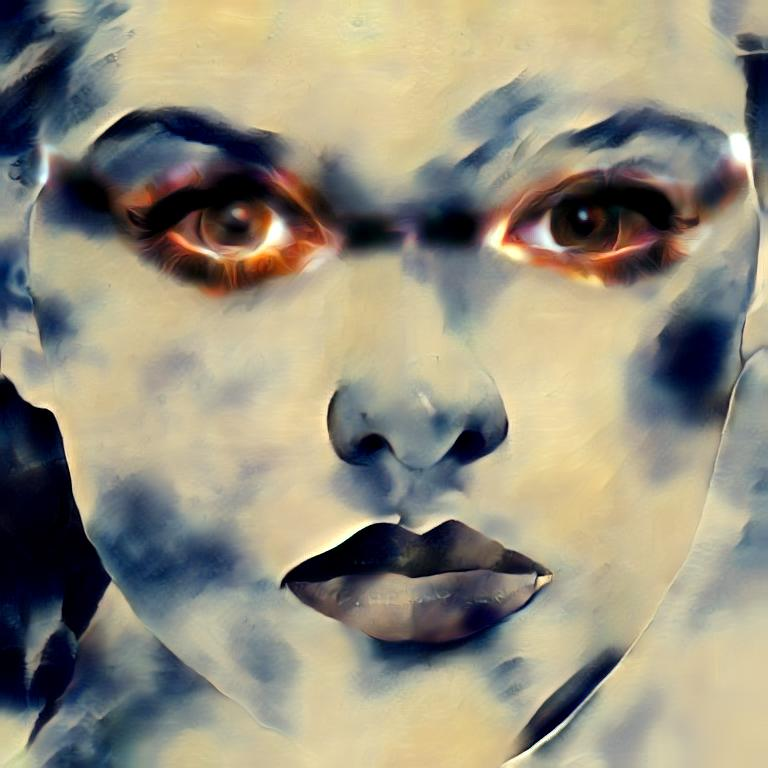

# UniversalStyleTransfer
Torch implementation of our [paper](https://arxiv.org/pdf/1705.08086.pdf) on universal style transfer. For academic use only.



## Prerequisites

- Linux
- NVIDIA GPU + CUDA CuDNN
- Torch 
- Pretrained encoder and decoder [models](https://drive.google.com/open?id=0B8_MZ8a8aoSeWm9HSTdXNE9Eejg) for image reconstruction only (download and put them under models/)

## Style transfer

- For a single pair test:

```
th test_wct.lua -content YourContentImagePath -style YourStyleImagePath -alpha YourStyleWeight
```

- For large numbers of pair test:

```
th test_wca.lua -contentDir YourContentImageDir -styleDir YourStyleImageDir -alpha YourStyleWeight
```

By default, we perform WCT (whitening and coloring transform) on relu1/2/3/4/5_1 features. 

We provide a parameter "-swap5 1" to perform swap operation on relu5_1 features. 

## Texture synthesis

```
th test_wct.lua -style YourStyleImagePath -synthesis 1 
```


## Spatial control

Style1 for foreground (mask=1), Style2 for background (mask=0), provided a binary mask



```
th test_wct_spatial2style.lua -content YourConentPath -style YourStylePath1,YourStylePath2 -mask YourBinaryMaskPath
```

## Note

To save memory for testing image of large size, we need to often load and delete model. So in our code, for the transferring on each content/style pair, we need to reload the model.

For a GPU of memory ~12G, it is suggested that the contentSize and styleSize are all less than 900 (800 recommended for the largest size).

I found that using "CUDA_VISIBLE_DEVICES=X" is better than using "-gpu X" as the former choice will guarantee that all weights/gradients/input will be located on the same GPU.

## Acknowledgement

We express gratitudes to the great work [AdaIN](https://github.com/xunhuang1995/AdaIN-style) as we benefit a lot from both their paper and codes.
