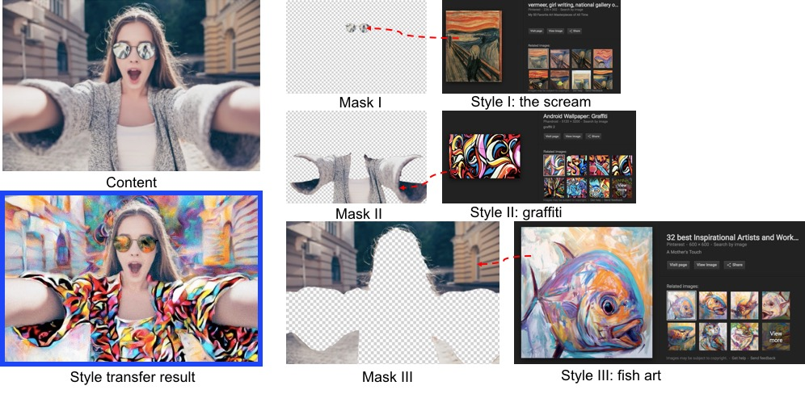
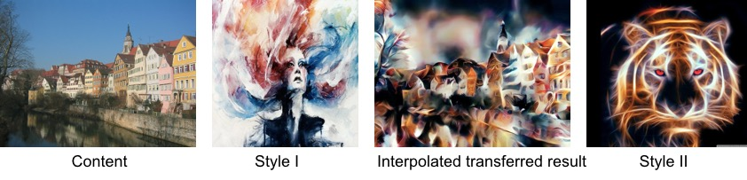
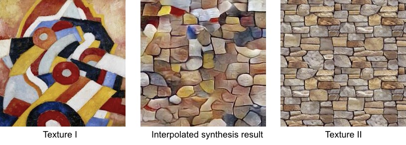
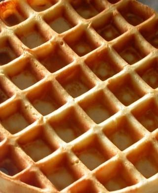
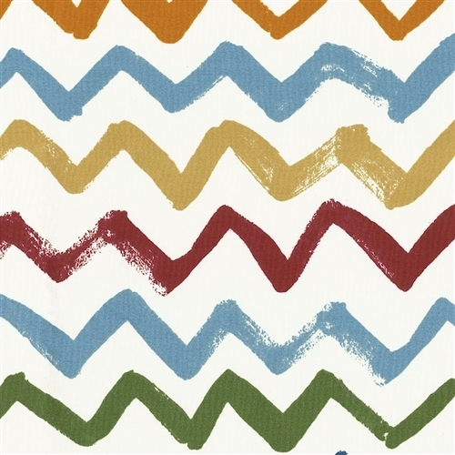
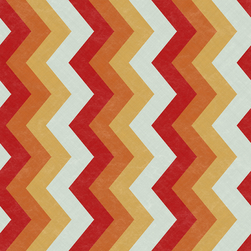
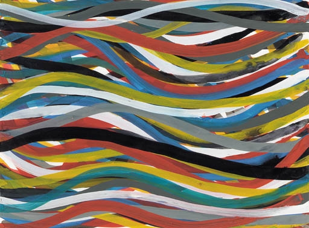
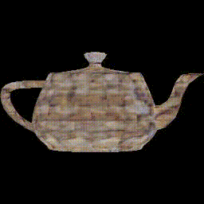
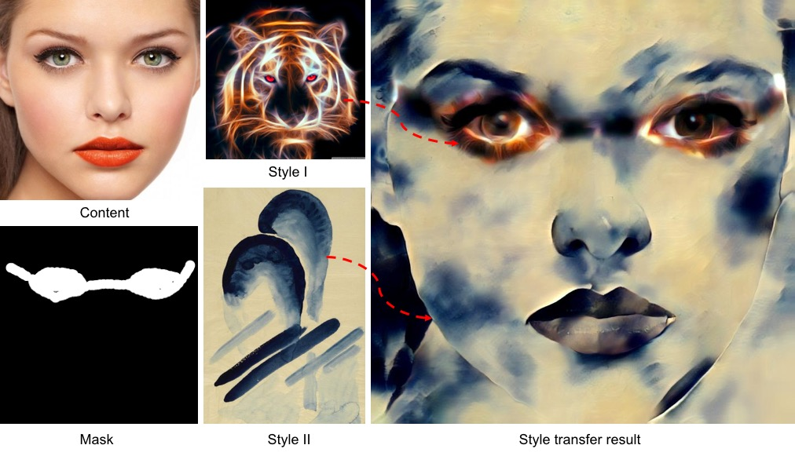
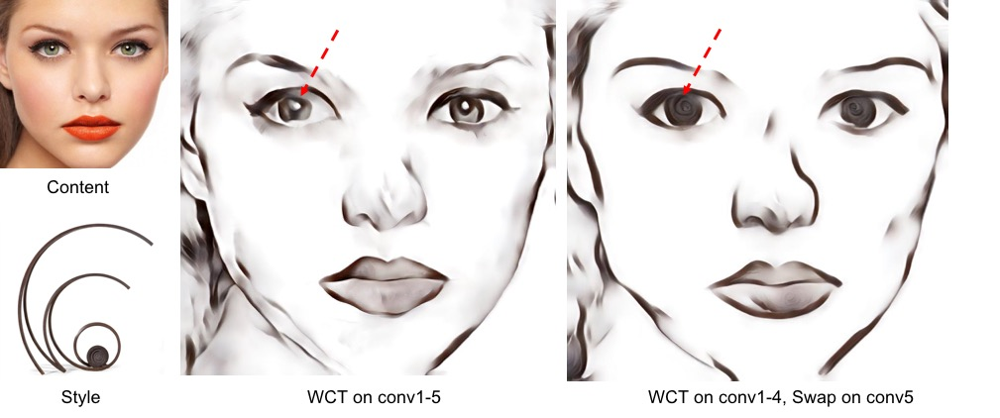

# [UniversalStyleTransfer](https://arxiv.org/pdf/1705.08086.pdf)
Torch implementation of our NIPS17 [paper](https://arxiv.org/pdf/1705.08086.pdf) on universal style transfer.

 TensorFlow [implementation](https://github.com/eridgd/WCT-TF) by Evan Davis. 

 PyTorch [implementation](https://github.com/sunshineatnoon/PytorchWCT) by Xueting Li.

 MatConvNet [implementation](https://github.com/ryanwebster90/autonn-universal-style-transfer-WCT) by Ryan Webster.

Universal style transfer aims to transfer arbitrary visual styles to content images. As long as you can find your desired style images on web, you can edit your content image with different transferring effects.




## Prerequisites

- Linux
- NVIDIA GPU + CUDA CuDNN
- Torch 
- Pretrained [encoders & decoders](https://drive.google.com/open?id=0B8_MZ8a8aoSeWm9HSTdXNE9Eejg) for image reconstruction only (put them under models/). If no CuDNN installed, please download the decoders [here](https://drive.google.com/open?id=1wVPtu4gGkUWpb9YtRecveFvdo4ZN5kMD).

## Style transfer

- For a single pair test:

```
th test_wct.lua -content YourContentPath -style YourStylePath -alpha 0.6
```

- For large numbers of pair test:

```
th test_wct.lua -contentDir YourContentDir -styleDir YourStyleDir -alpha 0.6
```

By default, we perform WCT (whitening and coloring transform) on conv1-5 features. The "-alpha" serves as the style weight to control the transfer effect. Some transfer results and comparisons with existing methods are shown [here](https://drive.google.com/file/d/0B8_MZ8a8aoSed3RrcTBfM1hES3c/view).

For comparison, we replace WCT with [AdaIN](https://github.com/xunhuang1995/AdaIN-style) (adaptive instance normalization), another way of transform proposed in [[Huang et al., ICCV17]](https://arxiv.org/pdf/1703.06868.pdf).

```
th test_adain.lua -content YourContentPath -style YourStylePath
```


## Texture synthesis

By setting the content image as a random noise image, our stylization framework can be easily applied to texture synthesis. Different input noise leads to diverse synthesis results. Moreover, we can adjust the parameter "-styleSize" as a kind of scale control to obtain different effects.

```
th test_wct.lua -style YourTexturePath -synthesis 1 -styleSize 512
```


## Interpolation

Our method also supports the transferring or synthesis of multiple styles thourgh interpolation. Below is an example of handling two styles. The "-beta" serves as the intepolation weight.


- Interpolated style transferring ([demo](https://www.youtube.com/watch?v=8V1dNu9doao), -beta from 1 to 0)
```
th test_wct_interpolation2.lua -content YourContentPath -style YourStylePath1,YourStylePath2 -beta 0.5
```


- Interpolated texture synthesis ([demo](https://www.youtube.com/watch?v=5sQbDv_eO0g), -beta from 1 to 0)
```
th test_wct_interpolation2.lua -style YourTexturePath1,YourTexturePath2 -beta 0.5 -synthesis 1
```



Below we show an example of texture synthesis path from t1 (left) to t2, then t3, ..., to t8 and back to t1. We also try the [Neural 3D Mesh Renderer](https://github.com/hiroharu-kato/neural_renderer) to apply the synthesized texture on a 3D Mesh.

<p>
    
    
     
    
    
    
    
    
</p>

<p>
    
     
    
    
</p>


## Spatial control

Often times, the one-click global transfer still does not meet requirements from professinal users (e.g., artists). Users prefer to transfer different styles to different regions in the content image, i.e., spatial control. We provide an example of transferring two styles to the foreground and background respectively, i.e., Style I for foreground (mask=1), Style II for background (mask=0), provided a binary mask.

```
th test_wct_mask.lua -content YourConentPath -style YourStylePath1,YourStylePath2 -mask YourBinaryMaskPath
```




## Swap on conv5

We also include the [Style-swap](https://github.com/rtqichen/style-swap) function in our algorithm. For each whitened content feature patch, we swap it with nearest whitened style feature patch. Please refer to the Style-swap [paper](https://arxiv.org/pdf/1612.04337.pdf) for more details.

We provide a parameter "-swap5" to perform swap operation on conv5 features. As the swap operation is computationally expensive (searching nearest patches), we do not carry out the swapping on early layers with large feature maps (e.g., conv1-4).

```
th test_wct.lua -content YourContentPath -style YourStylePath -swap5 1
```
Below is an exemplary comparison between w/o and w/ swap operation on conv5. With the swapping, the eyeball in the content is replaced with the ball in the style (bottom) as they are cloeset neighbours in whitened feature space.



## Note

- In theory, the covariance matrix of whitened features should be Identity. In practise, it is not because we need to eliminate some extremely small eigen values (e.g., <1e-10) or add a small constant (e.g., 1e-7) to all eigen values in order to perform the inverse operation (D^-1/2) in the whitening.

- The whitening method we used here is the **ZCA** whitening. Please take a look at this [blog](http://joelouismarino.github.io/blog_posts/blog_whitening.html) and this related [paper](https://arxiv.org/pdf/1512.00809.pdf) which discuss the optimality of different whitening methods.

- Our decoders trained for reconstruction is not perfect. As inverting deeper features (e.g., conv5_1) to RGB images is relatively difficult, we expect better decoders from researchers. If users prefer to preserve detailed structures in the content during the transferring, a more powerful decoder is necessary.


## Citation

```
@inproceedings{WCT-NIPS-2017,
    author = {Li, Yijun and Fang, Chen and Yang, Jimei and Wang, Zhaowen and Lu, Xin and Yang, Ming-Hsuan},
    title = {Universal Style Transfer via Feature Transforms},
    booktitle = {Advances in Neural Information Processing Systems},
    year = {2017}
}
```

## User study

A common issue in style transfer is the evaluation. To understand the user preference, we conduct a user study to evaluate 5 methods shown in Figure 6 of our paper. We appreciate your help if you can spend 3~4 minutes on this [study](http://169.236.182.49:8008/). Check the updated feedback [here](http://169.236.182.49:8008/dump) from extensive users. Please be polite and serious on results and comments.


## Acknowledgement

- We express gratitudes to the great work [AdaIN](https://github.com/xunhuang1995/AdaIN-style) and [Style-swap](https://github.com/rtqichen/style-swap) as we benefit a lot from both their papers and codes.

- We thank [Wei-Sheng Lai](http://graduatestudents.ucmerced.edu/wlai24/) for his huge help on the user study design and all subjects that provide helpful feedbacks and suggestions.
